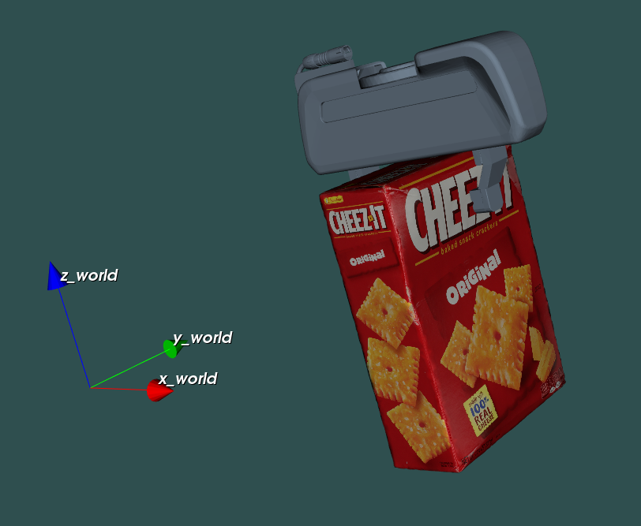

# manip-env-visu
Barebones library to visualize simple manipulation environments

### Dependencies

- **Eigen3** - is typically bundled with ubuntu distros, or can be installed via package manager. Otherwise, use the `-DEIGEN_DIR=<eigen_cmake_path>` option when running cmake
- **liburdfdom** - can be installed via package manager, in recent ubuntu distros this does not require ROS
- **VTK** - this can also be installed via package manager, but you will need VTK>=8.2 in order for this code to work. I strongly suggest compiling VTK 8.2 from source and running cmake with the option `-DVTK_DIR=<vtk_cmake_path>`.

**Note on compilers** - This code uses the `filesystem` header, which is part of the standard c++ libraries since c++17. If you have an older compiler (e.g. `gcc-7`, as it is default on Ubuntu 18.04) you need to upgrade it. For instance, you can do it using 
```
sudo apt install software-properties-common build-essentials
sudo add-apt-repository ppa:ubuntu-toolchain-r/test
sudo apt update
sudo apt install gcc-9 g++-9
```
and then use the additional `-D CMAKE_C_COMPILER=gcc-9 -D CMAKE_CXX_COMPILER=g++-9` cmake flags. 

### Usage

1. **Build**

    ```
    git clone https://github.com/fbottarel/manip-env-visu
    cd manip-env-visu
    mkdir build
    cd build
    cmake .. -DVTK_DIR=<vtk_cmake_path> -DCMAKE_INSTALL_PREFIX=<your_install_path>
    make install
    ```
    The `make install` is optional, you can just `make`.
1. **Use**

    In your `CMakeLists.txt`, make sure to find the library. In case of a custom installation path, specify the `manip-env-visu_DIR` explicitly. Also, make sure to update your `LD_LIBRARY_PATH` accordingly, since this is a shared library. If you use the default install path, it will be found automatically.

    A minimal example `CMakeLists.txt` for a `test.cpp` file looks something like this

    ```
    cmake_minimum_required(VERSION 3.3 FATAL_ERROR)
    project(example-cpp)
    set(CMAKE_CXX_STANDARD 17)
    find_package(manip-env-visu REQUIRED)

    add_executable(example-cpp main.cpp)

    target_link_libraries(example-cpp
                          manip-env-visu)
    ```
1. **Whine**

    Let me know when something doesn't work. Open an issue and I'll try to help!

### Docker

I added a Docker example in order to show how to install the essential dependencies from scratch. You can use it as a development environment, if you wish!

Assuming you have Docker installed, build the image with
```
 cd docker
 docker build -t fbottarel/manip-env-visu:latest .
```
and run the aptly named `run.sh` shell script.

### Example

A simple visualization with a gripper, an object and world reference frame should look like this.


